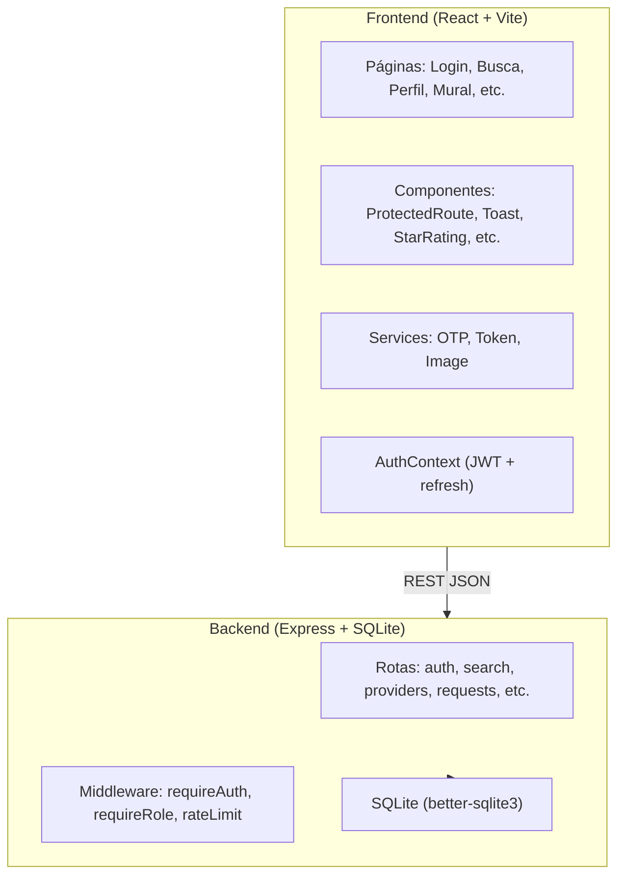

# IworkG — Marketplace de Serviços

[](https://opensource.org/licenses/MIT)
[]()

Conecta clientes a prestadores de serviços de construção e manutenção (eletricistas, encanadores, pedreiros, etc.) com busca georreferenciada e portfólio visual "Antes e Depois".

## Stack

| Camada   | Tecnologia                          |
|----------|-------------------------------------|
| Backend  | Node.js + Express + TypeScript      |
| Frontend | React + Vite + TypeScript           |
| Banco    | SQLite (better-sqlite3)             |
| Auth     | Google OAuth 2.0 + SMS OTP          |
| Mapa     | Geolocation API + ViaCEP + Haversine|
| Testes   | Vitest + Supertest                  |

## Arquitetura



## Estrutura

```
IworkG/
├── backend/
│   ├── src/
│   │   ├── config.ts            # Variáveis de ambiente
│   │   ├── db.ts                # Schema + seed + queries
│   │   ├── server.ts            # Servidor Express
│   │   ├── types.ts             # Tipos TypeScript
│   │   ├── middleware/
│   │   │   ├── auth.ts          # requireAuth + requireRole
│   │   │   └── rateLimit.ts     # Rate limiting
│   │   ├── routes/
│   │   │   ├── auth.ts          # Google OAuth, OTP, refresh, logout
│   │   │   ├── search.ts        # Categorias + busca prestadores
│   │   │   ├── provider.ts      # Wizard, perfil próprio, portfólio
│   │   │   ├── providers.ts     # Perfil público, edição, reviews, reports
│   │   │   ├── requests.ts      # CRUD pedidos, interesse, mural
│   │   │   ├── contacts.ts      # Histórico de contatos
│   │   │   ├── favorites.ts     # Favoritos (toggle)
│   │   │   ├── notifications.ts # Notificações + preferências
│   │   │   └── admin.ts         # Painel admin (dashboard, categorias)
│   │   ├── services/
│   │   │   ├── otp.ts           # Geração/verificação OTP
│   │   │   ├── token.ts         # JWT access + refresh tokens
│   │   │   └── image.ts         # Processamento de imagem (Jimp)
│   │   └── __tests__/           # Testes unitários/integração
│   │       ├── auth.test.ts
│   │       ├── search.test.ts
│   │       ├── providers.test.ts
│   │       ├── requests.test.ts
│   │       ├── contacts.test.ts
│   │       ├── favorites.test.ts
│   │       ├── notifications.test.ts
│   │       └── admin.test.ts
│   ├── data/                    # Banco SQLite (gitignored)
│   ├── uploads/                 # Imagens de portfólio (gitignored)
│   ├── .env.example
│   └── package.json
├── frontend/
│   ├── src/
│   │   ├── App.tsx              # Rotas
│   │   ├── index.css            # Estilos globais
│   │   ├── styles/tokens.css    # Design tokens
│   │   ├── contexts/
│   │   │   └── AuthContext.tsx  # Estado global de auth
│   │   ├── components/
│   │   │   ├── ProtectedRoute.tsx
│   │   │   ├── Button.tsx
│   │   │   ├── Card.tsx
│   │   │   ├── Chip.tsx
│   │   │   ├── Modal.tsx
│   │   │   ├── Toast.tsx
│   │   │   ├── StarRating.tsx
│   │   │   ├── InteractiveStars.tsx
│   │   │   ├── PortfolioGallery.tsx
│   │   │   ├── ReviewSection.tsx
│   │   │   ├── ReportModal.tsx
│   │   │   ├── ContactModal.tsx
│   │   │   ├── ProgressBar.tsx
│   │   │   └── RaioSlider.tsx
│   │   ├── pages/
│   │   │   ├── LoginPage.tsx
│   │   │   ├── OTPPage.tsx
│   │   │   ├── AuthCallbackPage.tsx
│   │   │   ├── ForgotAccessPage.tsx
│   │   │   ├── DashboardPage.tsx
│   │   │   ├── SearchPage.tsx
│   │   │   ├── RequestDetailPage.tsx
│   │   │   ├── NewRequestPage.tsx
│   │   │   ├── MyRequestsPage.tsx
│   │   │   ├── RequestBoardPage.tsx
│   │   │   ├── ProviderProfilePage.tsx
│   │   │   ├── ProviderEditPage.tsx
│   │   │   ├── MyProviderPage.tsx
│   │   │   ├── ProviderRegisterPage.tsx
│   │   │   ├── ContactsPage.tsx
│   │   │   ├── FavoritesPage.tsx
│   │   │   ├── NotificationsPage.tsx
│   │   │   ├── NotificationPreferencesPage.tsx
│   │   │   ├── AdminDashboardPage.tsx
│   │   │   ├── AdminCategoriesPage.tsx
│   │   │   ├── AdminPage.tsx
│   │   │   ├── DesignPage.tsx
│   │   │   ├── HelpPage.tsx
│   │   │   ├── TermsPage.tsx
│   │   │   └── PrivacyPage.tsx
│   │   └── services/
│   │       ├── api.ts           # Axios + interceptors
│   │       ├── auth.ts          # Auth API
│   │       ├── search.ts        # Search API
│   │       ├── provider.ts      # Provider wizard API
│   │       ├── providers.ts     # Provider profile API
│   │       ├── requests.ts      # Requests API
│   │       ├── history.ts       # Contacts/Favorites API
│   │       ├── notifications.ts # Notifications API
│   │       ├── admin.ts         # Admin API
│   │       └── location.ts      # Geolocation helpers
│   ├── .env.example
│   └── package.json
├── .github/workflows/
│   └── test.yml                 # CI pipeline
├── package.json
├── .gitignore
└── README.md
```

## Como rodar

### Pré-requisitos

- Node.js ≥ 18
- npm ≥ 9

### Instalação

```bash
npm run install:all
```

### Desenvolvimento

```bash
npm run dev
```

Inicia ambos servidores simultaneamente:
- **Backend:** http://localhost:3001
- **Frontend:** http://localhost:5173

### Variáveis de ambiente

```bash
cp backend/.env.example backend/.env
cp frontend/.env.example frontend/.env
```

Configure no `backend/.env`:
- `GOOGLE_CLIENT_ID` — ID do app Google Cloud Console
- `GOOGLE_CLIENT_SECRET` — Secret do app Google
- `JWT_SECRET` — Chave para assinar tokens JWT
- `FRONTEND_URL` — URL do frontend (default: http://localhost:5173)

### Build

```bash
cd backend && npm run build
cd ../frontend && npm run build
```

### Testes

```bash
cd backend && npm test
```

## Documento de API

### Autenticação (`/api/auth`)

| Método | Rota | Auth | Descrição |
|--------|------|------|-----------|
| POST | `/google` | Não | Login com Google ID token |
| GET | `/google/url` | Não | URL de autorização Google |
| GET | `/google/callback` | Não | Callback OAuth |
| POST | `/otp/send` | Não | Enviar código OTP |
| POST | `/otp/verify` | Não | Verificar OTP e obter tokens |
| POST | `/refresh` | Não | Renovar access token |
| POST | `/logout` | Sim | Invalidar token |
| GET | `/me` | Sim | Dados do usuário logado |
| POST | `/recover/send` | Não | Enviar código recuperação |
| POST | `/recover/verify` | Não | Verificar código recuperação |
| POST | `/recover/reset` | Não | Redefinir método de acesso |
| DELETE | `/account` | Sim | Excluir/anonymizar conta |

### Busca (`/api`)

| Método | Rota | Auth | Descrição |
|--------|------|------|-----------|
| GET | `/categories` | Não | Listar categorias |
| GET | `/providers/search?lat=&lng=&radius_km=&category_id=&query=` | Não | Buscar prestadores |

### Provider Wizard (`/api/provider`) — requer auth

| Método | Rota | Descrição |
|--------|------|-----------|
| GET | `/wizard` | Estado do wizard |
| PUT | `/wizard` | Salvar progresso |
| POST | `/wizard/complete` | Finalizar cadastro |
| GET | `/me` | Perfil próprio com serviceRadiusKm |
| POST | `/portfolio/upload` | Upload de foto (multipart) |
| GET | `/me/portfolio` | Portfólio próprio |
| GET | `/:id/portfolio` | Portfólio público |

### Provider Profiles (`/api/providers`)

| Método | Rota | Auth | Descrição |
|--------|------|------|-----------|
| GET | `/:id` | Não | Perfil público do prestador |
| GET | `/profile/mine` | Sim | Perfil próprio para edição |
| PUT | `/profile` | Sim | Atualizar perfil |
| POST | `/portfolio` | Sim | Adicionar imagem (URL) |
| DELETE | `/portfolio/:id` | Sim | Remover imagem |
| GET | `/:userId/reviews` | Não | Listar avaliações |
| POST | `/:userId/reviews` | Sim | Criar avaliação |
| POST | `/:userId/report` | Sim | Denunciar prestador |
| GET | `/admin/reports` | Admin | Listar denúncias pendentes |

### Requests (`/api/requests`) — requer auth

| Método | Rota | Descrição |
|--------|------|-----------|
| GET | `/open` | Buscar pedidos abertos (mural) |
| POST | `/` | Publicar novo pedido |
| GET | `/mine` | Meus pedidos (cliente) |
| GET | `/:id` | Detalhes do pedido |
| POST | `/:id/interest` | Demonstrar interesse (prestador) |
| GET | `/:id/interests` | Ver interessados |

### Contacts (`/api/contacts`) — requer auth

| Método | Rota | Descrição |
|--------|------|-----------|
| GET | `/` | Histórico de contatos |
| POST | `/` | Registrar novo contato |

### Favorites (`/api/favorites`) — requer auth

| Método | Rota | Descrição |
|--------|------|-----------|
| GET | `/` | Listar favoritos |
| POST | `/:providerId` | Toggle favorito |
| GET | `/check/:providerId` | Verificar se favoritado |

### Notifications (`/api/notifications`) — requer auth

| Método | Rota | Descrição |
|--------|------|-----------|
| GET | `/` | Listar notificações + unreadCount |
| PATCH | `/:id/read` | Marcar como lida |
| PATCH | `/read-all` | Marcar todas como lidas |
| GET | `/preferences` | Preferências de notificação |
| PUT | `/preferences` | Atualizar preferências |

### Admin (`/api/admin`) — requer role admin

| Método | Rota | Descrição |
|--------|------|-----------|
| GET | `/stats?days=30` | Dashboard analytics |
| GET | `/categories` | Categorias com contagem |
| POST | `/categories` | Criar categoria |
| PUT | `/categories/:id` | Editar categoria |
| DELETE | `/categories/:id` | Soft/hard delete categoria |

## Fluxos Principais

### Cliente — Busca e Contratação
1. Login (Google ou OTP) → `/buscar`
2. Busca por categoria + geolocalização automática
3. Visualiza perfil do prestador (avaliações, portfólio)
4. Publica pedido → `/publicar`
5. Recebe interesses → notificação
6. Visualiza interessados → contato

### Prestador — Cadastro e Serviço
1. Login → Dashboard
2. "Tornar-se Prestador" → Wizard 6 etapas
3. Upload de portfólio "Antes e Depois"
4. Toggle disponível/ocupado + raio de atuação
5. Mural de pedidos → demonstrar interesse
6. Recebe avaliações → notificação

### Admin — Gestão
1. Login como admin → `/admin/dashboard`
2. Dashboard com métricas (período selecionável)
3. CRUD de categorias
4. Revisão de denúncias

## Licença

MIT
